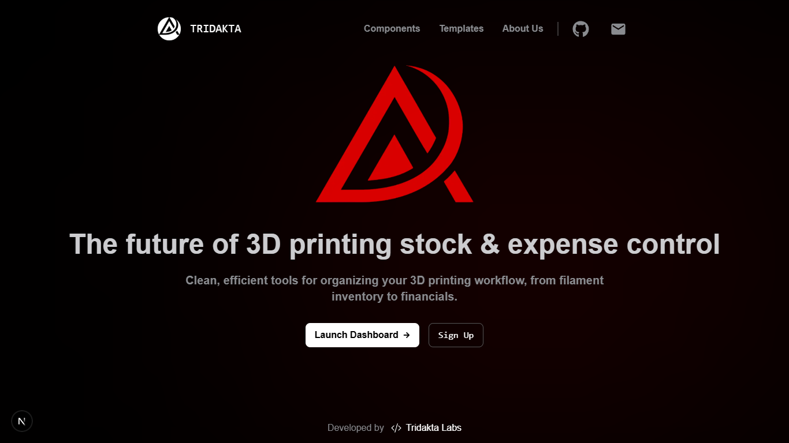
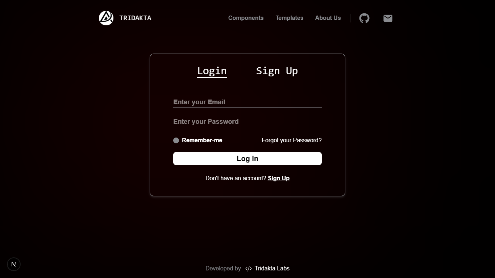
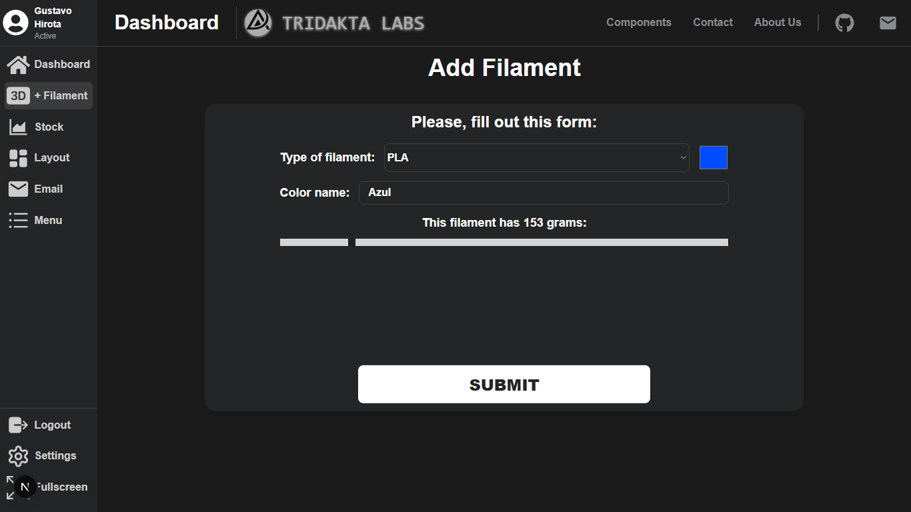
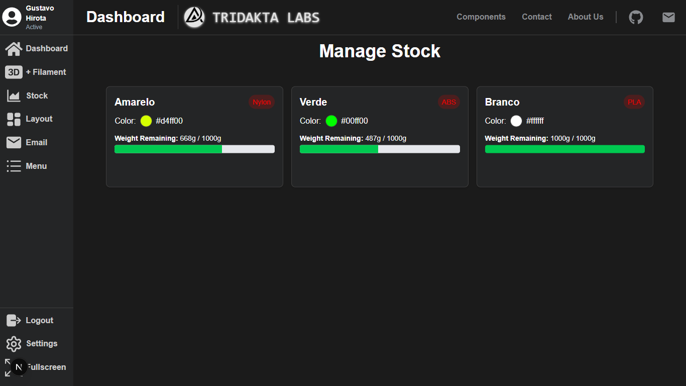

# Tridakta 📊

**Tridakta** is a web app to help you manage your 3D printer filament stock 📦, track expenses 💸, and get real-time insights through an intuitive dashboard 📊. Perfect for makers, hobbyists, and professionals who want to keep their 3D printing workflow smooth and organized! 🚀

## 📸 Project Screenshots

<table width="100%">
  <tr>
    <td width="50%">
      
    </td>
    <td width="50%">
      
    </td>
  </tr>
  <tr>
    <td width="50%">
      
    </td>
    <td width="50%">
      
    </td>
  </tr>
</table>

---

## Features ✨

- 📦 **Filament Stock Management:** Easily add, update, and monitor your filament inventory.
- 💰 **Expense Tracking:** Keep an eye on your spending and costs related to 3D printing.
- 📊 **Dashboard:** Visualize your filament usage and financial data in real-time.
- 🧑‍💻 **User-friendly Interface:** Designed for effortless navigation and productivity.

## Tech Stack 🛠️

- Frontend: Next.js application using Typescript ⚛️
- Backend: Firebase (BaaS) 🍃
- Database: Firebase 🍃
- Styling: Tailwind CSS 💨    

---

## Contribution 🤝

Contributions, issues, and feature requests are welcome! Feel free to dive in and help make Tridakta even better. 💪✨

---

## License 📄

This project is licensed under the MIT License. See the [LICENSE](LICENSE) file for details.
